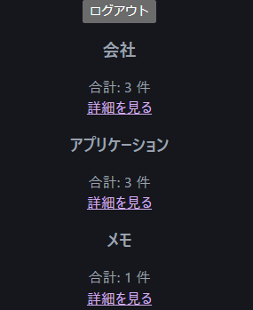
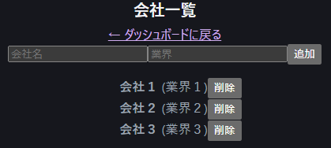
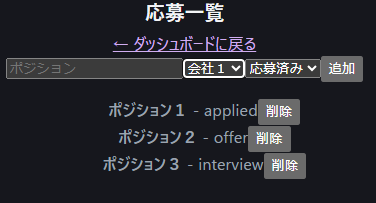

# Mensetu - 面接管理アプリ

面接情報や企業・応募・ノート・ユーザー管理を行うバックエンドと、React + Viteを用いたフロントエンドを備えたアプリケーションです。

---

## デモ
- バックエンド: [https://mensetu-bakku.onrender.com]  
- フロントエンド: [https://mensetu-furonto.onrender.com]
- API ドキュメント: [https://mensetu-bakku.onrender.com/docs]






 

### バックエンド
- Python 3.12
- FastAPI + Uvicorn
- SQLAlchemy (Async) + Alembic
- PostgreSQL
- Argon2 (パスワードハッシュ)
- Python-JOSE (JWT認証)

### フロントエンド
- React + Vite

### 開発環境
- Docker + Docker Compose
- Pytest + pytest-asyncio + httpx
- GitHub Actions CI

---

## 環境構築（ローカル）

### 前提
- Docker & Docker Compose
- Python 3.12

### バックエンド起動

```bash
cd backend
docker-compose up --build
```
データベースコンテナはPostgreSQL

初回起動時にマイグレーションを実行する場合は以下でも可:

docker-compose exec backend alembic upgrade head
フロントエンド起動
```bash
cd frontend
npm install
npm run dev
```
環境変数

.env で以下を設定：
```bash
DATABASE_URL=postgresql+asyncpg://<user>:<password>@<host>:<port>/<db>
JWT_SECRET_KEY=<your_secret_key>
FRONT=<frontend_origin>
```
API概要
ユーザー

/api/v1/users → 登録、ログイン、情報取得

企業

/api/v1/companies → CRUD

応募

/api/v1/applications → 応募情報管理（ステータス：applied/interview/offer/rejected）

ノート

/api/v1/notes → 応募ごとのメモ

認証

JWTベース

OAuth2PasswordBearerでアクセストークン管理

モデル概要

User

id, email, hashed_password, is_active, created_at

Company

id, name, industry, created_at

Application

id, position, status, applied_date, interview_date, company_id, user_id

Note

id, content, application_id, created_at

GitHub Actions CI

プッシュまたはPR時に自動テスト

PostgreSQLコンテナを立ち上げてテストDBでマイグレーション後にpytest実行

カバレッジ概要

全160ステートメント中6ステートメントが未カバー

総合カバレッジ 96.2%

主な未カバー箇所は auth.py と db.py の一部

他のファイル（models.py、schemas.py、main.py、__init__.py）は100%カバレッジ